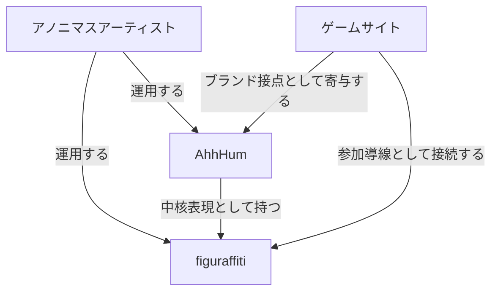

# AhhHum figuraffiti 関係定義ドキュメント

本ドキュメントは、`AhhHum`、`figuraffiti`、ゲームサイト、アノニマスアーティストの関係を定義するための一次ソースである。  
各戦略文書、要件定義、コピーライティング、SNS運用方針は、本ドキュメントの定義を前提として記述する。

---

## 1. 定義の目的

これまでの議論では、`AhhHum` をブランドとして語る文脈と、`figuraffiti` を体験や文化として語る文脈が混在しやすかった。  
その結果、戦略文書ごとに主語がずれ、以下のような混乱が起きやすくなっていた。

- `AhhHum` がブランドなのか、探索体験そのものなのかが曖昧になる
- `figuraffiti` が作品名なのか、ジャンル名なのか、参加メカニズムなのかが曖昧になる
- ゲームサイトがブランドサイトなのか、参加ツールなのかがぶれる
- アノニマスアーティストが作者なのか、運営主体なのかが曖昧になる

本ドキュメントの目的は、これらの主従関係を固定し、以後の戦略と表現をぶれさせないことにある。

---

## 2. 関係の結論

関係性は、次の一文に要約される。

> **AhhHum はブランドであり、figuraffiti はその中核となる表現・参加メカニズムであり、ゲームサイトは figuraffiti に参加するための導線であり、アノニマスアーティストはその運用主体である。**

この関係を図式化すると、次の通り。

---

## 3. AhhHum とは何か

`AhhHum` は、物販を成立させるためのブランド名である。  
ここでいう物販とは、単なる商品販売ではなく、世界観、造形、物理商品、参加構造を束ねて成立するブランド活動全体を指す。

AhhHum の役割は次の通り。

- 商品として流通する名前である
- 顧客が認識し、記憶し、購入判断を下すブランド名である
- 物理商品、探索体験、世界観をまとめる上位レイヤーである
- 将来的な収益化、IP展開、共創展開の受け皿となる

重要なのは、`AhhHum` 自体を探索体験そのものと同一視しないことである。  
探索体験は AhhHum を成立させる重要要素だが、AhhHum の全体と同義ではない。

---

## 4. figuraffiti とは何か

`figuraffiti` は、AhhHum ブランドの中核となる表現形式であり、参加メカニズムである。

figuraffiti の特徴は次の通り。

- 都市空間に置かれるフィジカルな存在である
- 見るだけでなく、探し、見つけ、触れ、記録することで体験が成立する
- アート活動でありながら、参加構造を持つ
- AhhHum の物理商品やブランド価値を成立させる核になる

figuraffiti は、`AhhHum` の別名ではない。  
また、ゲームサイトの別名でもない。  
figuraffiti は、AhhHum の中で最も重要な表現と仕組みであり、ブランドに意味を与えるコア概念である。

---

## 5. ゲームサイトの役割

ゲームサイトは、figuraffiti に参加するための実用導線である。

このサイトの役割は次の通り。

- マップ上で手がかりを確認させる
- 現地探索へ誘導する
- NFC / QR / 記録導線を提供する
- 発見記録や参加履歴を成立させる

つまり、ゲームサイトは `AhhHum` の一般的なブランドサイトではなく、`figuraffiti` に参加するための道具である。  
ただし同時に、ブランドへの接点としても機能するため、完全に切り離された別物ではない。

整理すると、

- 主機能: `figuraffiti` 参加導線
- 副次機能: `AhhHum` ブランド接点

である。

---

## 6. アノニマスアーティストの位置づけ

アノニマスアーティストは、figuraffiti を運用する主体であり、同時に AhhHum ブランドの実作者・運営者でもある。

その役割は次の通り。

- figuraffiti の設置、更新、運用を担う
- AhhHum ブランドの造形的・文化的な起点となる
- ブランドの実作者であり、運営主体でもある
- 必要に応じて話題化の起点にもなりうる

ここで重要なのは、アノニマスアーティストを単なる `起源` に留めないことだ。  
本定義では、アーティストは現在進行形の運用主体である。

---

## 7. 主語ルール

今後の文書作成では、次のルールで主語を固定する。

### 7.1 AhhHum を主語にする文脈

次の話題では、基本主語を `AhhHum` とする。

- ブランド戦略
- 商品戦略
- 収益化
- 物販
- 顧客認知
- IP展開
- 将来のブランド資産

### 7.2 figuraffiti を主語にする文脈

次の話題では、基本主語を `figuraffiti` とする。

- 表現形式の説明
- 参加の仕組み
- 都市空間での振る舞い
- 探索、発見、記録の体験
- フィジカルな実装

### 7.3 ゲームサイトを主語にする文脈

次の話題では、基本主語を `ゲームサイト` または `Webマップ` とする。

- 参加導線
- UI / UX
- マップ機能
- 記録機能
- 導線改善

### 7.4 アノニマスアーティストを主語にする文脈

次の話題では、基本主語を `アノニマスアーティスト` とする。

- 作者性
- 運用主体
- 話題化の起点
- 制作背景
- アート活動としての実践

---

## 8. 誤読を防ぐための禁止事項

今後の文書では、以下のような書き方を避ける。

- `AhhHum はフィギュア販売ではない` と断定し、物販ブランドである前提を消すこと
- `AhhHum = 探索体験そのもの` と読める書き方
- `figuraffiti = AhhHum の別名` と読める書き方
- `ゲームサイト = ブランド本体` と読める書き方
- `アノニマスアーティスト = 単なる起源` に矮小化する書き方

代わりに、次のような書き方を採用する。

- AhhHum は物販ブランドである
- figuraffiti は AhhHum を成立させる中核表現である
- ゲームサイトは figuraffiti 参加導線である
- アノニマスアーティストはその運用主体である

---

## 9. 公開用語ルール

`figuraffiti` は、内部の設計・戦略・運用を整理するための概念であり、外部に公表する名称ではない。

したがって、次のルールを採用する。

- 戦略文書、設計文書、要件定義などの内部文書では `figuraffiti` を使用してよい
- Webサイト、SNS、商品説明、対外資料などの公開表現では `figuraffiti` を前面に出さない
- 外部には `AhhHum` をブランド名として提示し、その体験や特徴を翻訳して伝える
- `figuraffiti` の説明をそのまま公開コピーへ流用しない

外部で伝えるべきなのは `figuraffiti` という内部ラベルではなく、以下のような体験特徴である。

- 街に置かれている
- 見つけた人だけが触れられる
- 記録を残せる
- いつまでそこにあるか分からない

つまり、`figuraffiti` は内部概念、`AhhHum` は外部ブランド名、ゲームサイトは AhhHum 体験への参加導線として運用する。

---

## 10. 他ドキュメントへの適用方針

本定義は、少なくとも次の文書に適用する。

- `AhhHum ニッチマーケ戦略マスタードキュメント`
- `AhhHum SNSバズ戦略マスタードキュメント`
- 未来価値創造ドキュメント
- 要件定義
- Webサイトのコピー

各文書は本ドキュメントを前提に、必要な主語を選んで記述する。  
関係定義そのものを各所で作り直さない。

---

## 11. 結論

今後の定義は、次の形で固定する。

- `AhhHum` はブランド
- `figuraffiti` はその中核表現・参加メカニズム
- `ゲームサイト` は figuraffiti の参加導線
- `アノニマスアーティスト` はその運用主体

この主従関係を固定することで、戦略、実装、コピー、SNS運用の主語を揃える。

---

**作成日:** 2026-03-14  
**ステータス:** 定義ドラフト v1
