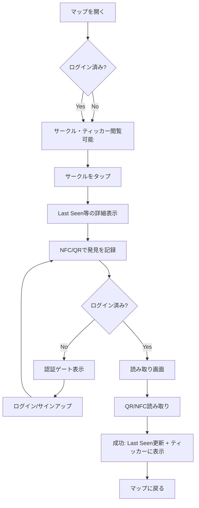

# AhhHum Phase1 UX設計書（MVP）

本ドキュメントは、**AhhHum ニッチマーケ戦略マスタードキュメント**、**ゲームフロー設計**、および **AhhHum Webアプリ全体設計マスタードキュメント** に基づき、AhhHumの**Phase1 MVP**におけるUX設計書・ワイヤーフレームを定義したものです。  
本書は **Phase1 の画面詳細書** と位置づけ、ルート・画面ID・Phase構成の最終定義は親設計を優先します。

---

## 1. 設計の前提とスコープ

### 1.1 参照ドキュメント
- [AhhHum ニッチマーケ戦略マスタードキュメント](../10_strategy_brand/AhhHum%20ニッチマーケ戦略マスタードキュメント.md)
- [AhhHum 最新ゲームフロー設計書：共創型・都市探索IPの完全版](./AhhHum%20最新ゲームフロー設計書：共創型・都市探索IPの完全版.md)

### 1.2 スコープ
| 項目 | 内容 |
| :--- | :--- |
| **対象フェーズ** | Phase 1（認知とシステムの稼働） |
| **成果物** | 設計書・ワイヤーフレーム（文書化まで） |
| **実装** | 承認後にPoC開発 |
| **プラットフォーム** | Webブラウザサービス（先行展開）→ 後にアプリ化 |

### 1.3 Phase1 MVP のコア機能
1. **曖昧なサークル表示** … マップ上に半径50mのサークルのみ表示し、正確な位置は隠す
2. **グローバル・ティッカー** … 発見ログを画面隅に一行で流し、システムの熱量を可視化
3. **NFC/QR タギング** … 発見時に読み取り、「Last Seen」を鮮度更新

---

## 2. 技術・運用要件

### 2.1 ユーザー認証

**必須要件:**
- 発見ログの記録・表示（ティッカーに表示するユーザー名の紐づけ）
- スポット申請（将来的なPhase2/3）
- NFC/QR読み取り時の「誰が発見したか」の紐づけ

**現行構成:**
| 項目 | 内容 |
| :--- | :--- |
| **採用サービス** | Supabase Auth |
| **認証方式** | メール/パスワード |
| **役割** | 認証・セッション管理・DB連携 |

**認証の代替案（参考）:**

| サービス | 特徴 | 主な用途 |
| :--- | :--- | :--- |
| **Supabase Auth**（現行） | BaaS統合、無料枠あり、即時導入可能 | 推奨継続 |
| **Clerk** | 開発者体験◎、UI/UXコンポーネント豊富、月額制 | 認証UIを高速化したい場合 |
| **Auth0** | エンタープライズ向け、SNSログイン幅広い | 大規模・多チャネルログイン |
| **Firebase Auth** | Google系、無料枠広い | 既存Firebase利用時 |
| **NextAuth.js** | OSS、Next.js親和性高 | 自前カスタマイズ重視 |

**推奨:** Phase1 MVPでは**Supabase Authを継続**し、PoCで検証後、必要に応じてClerk等への移行を検討する。

### 2.2 地図サービス

| 項目 | 内容 |
| :--- | :--- |
| **採用サービス** | Mapbox |
| **利用状況** | プロトタイプで既に利用中 |
| **用途** | 地図表示、曖昧サークル描画、逆ジオコーディング |
| **設定** | [Mapboxトークン設定](../30_technical_ops/Mapboxトークン設定.md) を参照 |

---

## 3. 画面構成と情報アーキテクチャ

### 3.1 画面一覧（Phase1 MVP）

| # | 画面ID | 画面名 | 認証 | 説明 |
| :---: | :--- | :--- | :---: | :--- |
| 1 | SCREEN-001 | マップメイン | 任意※ | 曖昧サークル・ティッカー表示の中心画面 |
| 2 | SCREEN-002 | サークル詳細（オーバーレイ） | 任意 | サークルタップ時のLast Seen等表示 |
| 3 | SCREEN-003 | NFC/QR読み取り | 必須 | 現地発見時のタギング処理 |
| 4 | SCREEN-004 | ログイン | - | メール/パスワードによるログイン |
| 5 | SCREEN-005 | サインアップ | - | 新規登録 |
| 6 | SCREEN-006 | 認証ゲート（モーダル） | - | 要認証機能実行時の認証促進 |

※マップ閲覧・サークル確認は未ログイン可。タギング・発見ログへの自身の記録はログイン必須。

### 3.2 ナビゲーション構造

```
[トップ] → /discover/mapping（マップメイン）
    ├── ヘッダー：ロゴ / ユーザーメニュー（未ログイン時は「ログイン」）
    ├── 地図エリア：曖昧サークル表示
    ├── ティッカー：画面下部または上部（固定）
    └── スポット詳細：サークルタップ → オーバーレイ / ボトムシート

[NFC/QR読み取り] → カメラ起動 or 手動入力（QRコード値）
    └── 成功時 → マップに戻り、該当サークルを「Last Seen: Just now」に更新
```

---

## 4. ワイヤーフレーム

### 4.1 マップメイン（SCREEN-001）

**レイアウト概要:**
```
┌─────────────────────────────────────────────────────────────┐
│ [AhhHum]                                          [ユーザー] │
├─────────────────────────────────────────────────────────────┤
│                                                             │
│         ┌─────────┐                                         │
│         │  ○ 50m  │  ← 曖昧なサークル（半径50m）             │
│         │ サークル │    色：鮮度に応じて変化                  │
│         └─────────┘     （高鮮度=赤系、中=黄、低=グレー）     │
│                                                             │
│                    ┌─────────┐                               │
│                    │  ○ 50m  │                               │
│                    └─────────┘                               │
│                                                             │
│  [現在地]                                                    │
│                                                             │
├─────────────────────────────────────────────────────────────┤
│ User_A just found #42 in Shibuya.     ← グローバル・ティッカー│
│ User_B just found #18 in Shimokitazawa.  （横スクロール/流し）│
└─────────────────────────────────────────────────────────────┘
```

**要素仕様:**
| 要素 | 仕様 |
| :--- | :--- |
| サークル | 半径50m、正確なピン位置は非表示。塗りつぶし+枠線 |
| サークル色 | 鮮度に応じて：高（24h以内）=赤系、中（〜7日）=黄系、低（7日〜）=グレー系 |
| ティッカー | 1行、横スクロール or マーキー形式。「*User_X just found #N in [地名].*」形式 |
| ヘッダー | ロゴ左、ユーザーメニュー右（未ログイン時は「ログイン」CTA） |
| 現在地ボタン | 地図右下などに配置 |

### 4.2 サークル詳細オーバーレイ（SCREEN-002）

**トリガー:** サークルをタップ

**レイアウト（ボトムシート型想定）:**
```
┌─────────────────────────────────────────────────────────────┐
│  ───  （ドラッグハンドル）                                    │
├─────────────────────────────────────────────────────────────┤
│  #42  渋谷 / かつて川だった場所                               │
│                                                             │
│  Last Seen: 2 hours ago    ← 鮮度表示（核心情報）            │
│                                                             │
│  [NFC/QRで発見を記録する]   ← CTA（未ログイン時は認証促進）   │
│                                                             │
└─────────────────────────────────────────────────────────────┘
```

**要素仕様:**
| 要素 | 仕様 |
| :--- | :--- |
| スポットID | #N 形式で表示 |
| 文脈 | 場所の簡潔な説明（例：「かつて川だった場所」） |
| Last Seen | 「Just now」「2 hours ago」「3 days ago」等、相対表示 |
| CTA | タギング導線。未ログイン時は押下で認証モーダル表示 |

### 4.3 NFC/QR読み取り（SCREEN-003）

**トリガー:** サークル詳細のCTA、または専用FAB/メニュー

**フロー:**
1. 読み取り画面を表示
2. カメラでQRコードをスキャン、またはNFCタッチ
3. 読み取ったIDをサーバーに送信
4. 該当スポットの `last_seen` を更新
5. 成功時：マップに戻り、該当サークルを「Last Seen: Just now」に更新
6. ティッカーに「*[自分の名前] just found #N in [地名].*」を追加

**ワイヤーフレーム:**
```
┌─────────────────────────────────────────────────────────────┐
│  ← 戻る              発見を記録                               │
├─────────────────────────────────────────────────────────────┤
│                                                             │
│           ┌─────────────────────────────┐                    │
│           │                             │                    │
│           │    [カメラプレビュー]        │                    │
│           │    QRコードを枠内に合わせて  │                    │
│           │    読み取ってください       │                    │
│           │                             │                    │
│           └─────────────────────────────┘                    │
│                                                             │
│  ※ NFC対応端末ではフィギュアにスマホをかざしても記録できます   │
│                                                             │
└─────────────────────────────────────────────────────────────┘
```

**代替（QRが読めない場合）:**
- 手動でスポットID（#N）を入力するフォールバック

### 4.4 認証（SCREEN-004, SCREEN-005）

**ログイン（SCREEN-004）:**
```
┌─────────────────────────────────────────────────────────────┐
│  [AhhHum]                                                    │
│                                                             │
│  ログイン                                                    │
│                                                             │
│  メールアドレス    [________________]                        │
│  パスワード        [________________]                        │
│                                                             │
│  [ログインする]                                              │
│                                                             │
│  アカウントをお持ちでない方 → サインアップ                   │
└─────────────────────────────────────────────────────────────┘
```

**サインアップ（SCREEN-005）:**
```
┌─────────────────────────────────────────────────────────────┐
│  [AhhHum]                                                    │
│                                                             │
│  新規登録                                                    │
│                                                             │
│  メールアドレス    [________________]                        │
│  パスワード        [________________]                        │
│  パスワード確認    [________________]                        │
│                                                             │
│  [登録する]                                                  │
│                                                             │
│  すでにアカウントをお持ちの方 → ログイン                     │
└─────────────────────────────────────────────────────────────┘
```

**認証ゲート（SCREEN-006）:**
- タギング等「要認証」操作時に表示するモーダル
- 「発見を記録するにはログインが必要です」+ ログイン/サインアップへの誘導

---

## 5. ユーザーフロー

### 5.1 初回訪問〜タギングまでの流れ



### 5.2 ティッカーのデータフロー

```
[ユーザーがNFC/QR読み取り]
    → サーバーで last_seen 更新
    → 発見ログテーブルにレコード追加
    → リアルタイム購読 or ポーリングでティッカーに配信
    → 「User_X just found #N in [地名].」を表示
```

---

## 6. インタラクション設計

### 6.1 サークル

| 操作 | 反応 |
| :--- | :--- |
| タップ | ボトムシート/オーバーレイで詳細表示（Last Seen、文脈、CTA） |
| 複数サークルが近接 | ズームインで分離、またはクラスタ表示後に展開 |
| 長押し | Phase1では未定義（将来：スポット申請等） |

### 6.2 ティッカー

| 項目 | 仕様 |
| :--- | :--- |
| 更新 | 新規発見ログが入ったら追加表示 |
| 表示形式 | `User_X just found #N in [地名].` （英語表記で世界観統一） |
| 流れ | 横スクロール（マーキー）または下から上へのスクロール |
| タップ | Phase1では無反応、将来的に該当スポットへフォーカス |

### 6.3 NFC/QR

| 項目 | 仕様 |
| :--- | :--- |
| 入力 | QRスキャン、NFCタッチ、手動ID入力（フォールバック） |
| 成功時 | Toast「発見を記録しました」+ マップに戻る + 該当サークル色を高鮮度に |
| 失敗時 | 「該当するスポットが見つかりません」等のエラーメッセージ |
| 重複 | 同一ユーザーが短時間に連続で同じスポットを記録する場合の扱いは要定義（例：クールダウン） |

---

## 7. データ要件（Phase1 MVP）

### 7.1 発見ログ（ティッカー用）

| 項目 | 内容 |
| :--- | :--- |
| user_id | 発見者（認証ユーザー） |
| spot_id | スポット |
| discovered_at | 発見日時 |
| 表示用 | ユーザー表示名（匿名化オプション検討）、スポット#N、地名 |

### 7.2 スポット（サークル用）

| 項目 | 内容 |
| :--- | :--- |
| lat, lng | 中心座標（サークル描画用） |
| radius_m | 50（固定想定） |
| last_seen | 最終発見日時（鮮度の色分け用） |
| context | 文脈テキスト（「かつて川だった場所」等） |
| spot_number | #N の N |

### 7.3 NFC/QR ペイロード

- QRコードまたはNFCに格納する値：`ahhhum://spot/{spot_id}` または `{spot_id}` のみ
- サーバー側で spot_id を検証し、存在すれば last_seen 更新 + 発見ログ作成

---

## 8. 非機能要件（UX観点）

| 項目 | 方針 |
| :--- | :--- |
| レスポンス | サークルタップ→詳細表示は200ms以内 |
| オフライン | Phase1では未対応。オンライン前提 |
| アクセシビリティ | キーボード操作、スクリーンリーダー対応はPhase1後でも検討 |
| 多言語 | Phase1は日本語UI、ティッカーは英語（世界観） |

---

## 9. Phase2以降との接続

| Phase | 追加機能（参考） | 本設計書との接続 |
| :--- | :--- | :--- |
| Phase 2 | 物理キー用フィギュア、休眠スポット（伝説）、Show Legendsトグル | サークルに「伝説モード」追加、色を金色に |
| Phase 3 | 設置申請、共創、アンバサダー制度 | 認証・プロファイル強化、申請フォーム |
| Phase 4 | アパレル等 | プロファイル・購買導線 |

---

## 10. 承認チェックリスト

実装着手前に、以下を確認・承認してください。

- [ ] 画面構成（3.1）の妥当性
- [ ] ワイヤーフレーム（4.1〜4.4）の承認
- [ ] ユーザーフロー（5.1）の承認
- [ ] 認証方式（Supabase継続）の承認
- [ ] 地図サービス（Mapbox継続）の承認
- [ ] データ要件（7節）と既存DB設計の整合

---

**作成日:** 2026-03-12  
**版:** 1.1  
**ステータス:** 承認待ち
