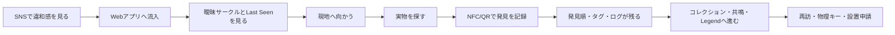
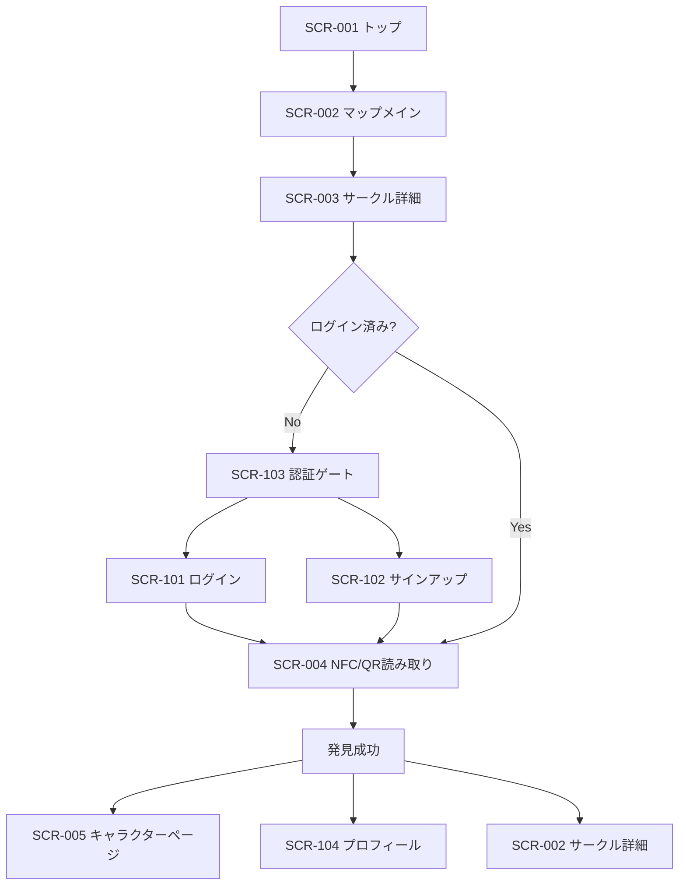
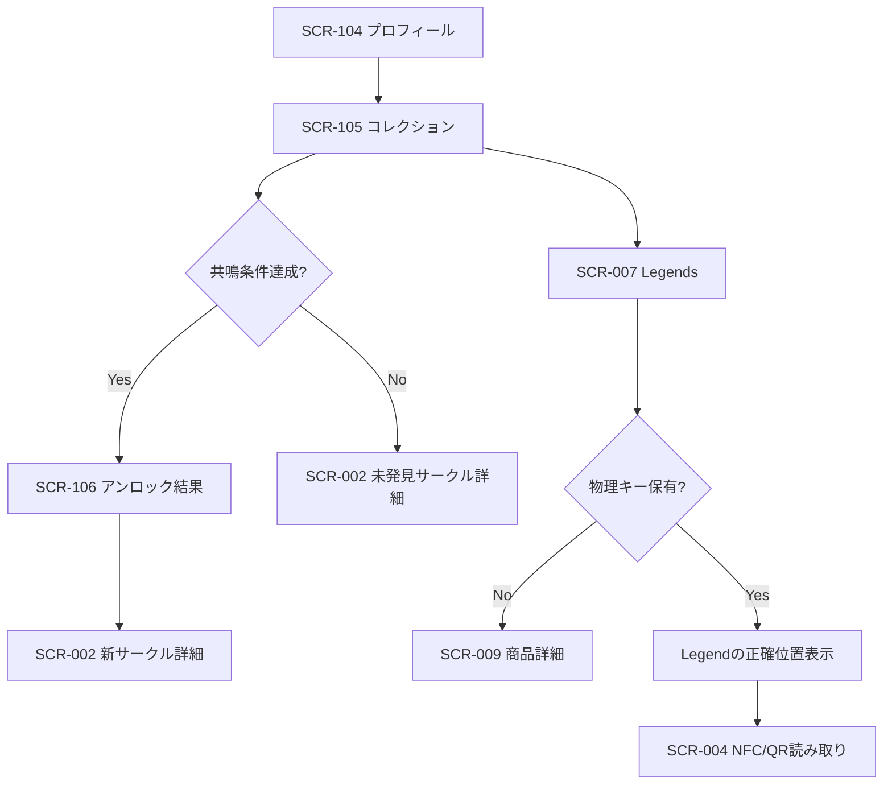
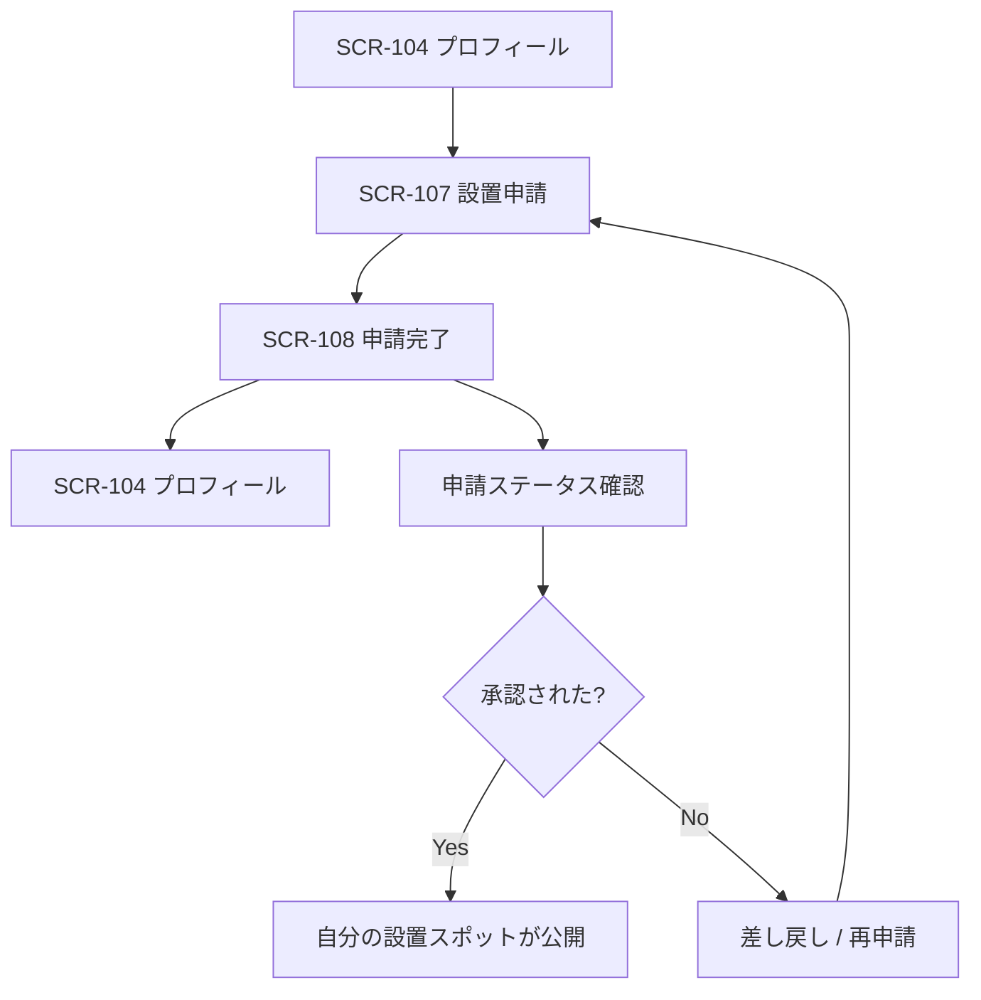
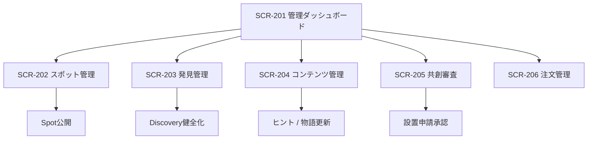

# AhhHum Webアプリ全体設計マスタードキュメント

本ドキュメントは、`AhhHum` の戦略・未来像・ゲームフローを前提に、サービスの核である Web アプリ全体を設計するための親ドキュメントである。  
役割は、既存の `Phase1 UX設計書` や `要件定義` の上位に立ち、**このサービスは Web アプリとして何を実現し、どの順序で拡張し、どのような体験構造を持つべきか** を定義することにある。

---

## 1. 設計の結論

AhhHum の Web アプリは、単なる地図アプリでも、単なる投稿サービスでも、単なる EC でもない。  
それは、**都市の違和感を発見し、行動で記録し、痕跡を残し、やがて世界を共創するまでの全プロセスを支える都市探索OS** である。

一文で言えば、AhhHum の Web アプリは次の存在を目指す。

> **SNSで生まれた関心を、都市での探索行動へ変換し、その行動を記録・蓄積・共創へ接続する中核プラットフォーム。**

---

## 2. 戦略前提

本設計は、以下の前提を固定して進める。

### 2.1 上位戦略から引き継ぐ前提

1. **初期市場は都内23区**  
   ただし実運用は重点区集中で始める

2. **SNS は入口、Web アプリが本体**  
   バズは認知であり、ブランド価値はアプリ内の探索体験で成立する

3. **体験が先、物販は後**  
   商品は体験の代替ではなく、体験の拡張として位置づける

4. **探索性・証明性・循環性・持続性が必要**  
   これがゲームフロー設計のコアである

5. **顧客は消費者ではなく参加者へ進化する**  
   見る人 -> 探す人 -> 記録する人 -> 集める人 -> 設置する人 -> 共創する人

### 2.2 Web アプリが果たすべき役割

Web アプリは次の 6 つの役割を担う。

1. **受け皿**  
   SNS から流入した関心を逃さない

2. **探索装置**  
   曖昧サークル、Last Seen、ヒントで現地行動を生む

3. **証明装置**  
   NFC/QR 読み取りで、発見を記録として確定する

4. **記憶装置**  
   発見ログ、デジタルタグ、Legend により痕跡を残す

5. **育成装置**  
   収集、共鳴、物理キー、共創権へ段階接続する

6. **運用装置**  
   ブランド基準、審査、設置管理、データ学習を支える

---

## 3. プロダクトコンセプト

### 3.1 サービスの定義

AhhHum の Web アプリは、以下の 4 レイヤーで構成する。

| レイヤー | 役割 | ユーザー価値 |
| :--- | :--- | :--- |
| **Discovery Layer** | SNS 流入後の期待形成 | 「何かが起きている」と感じる |
| **Exploration Layer** | マップ・ヒント・鮮度表示 | 「行ってみたい」「見つけたい」と感じる |
| **Proof Layer** | NFC/QR・発見順・タグ | 「自分が見つけた」と証明できる |
| **Expansion Layer** | コレクション・共鳴・Legend・共創 | 「次も関わりたい」「自分も世界を増やしたい」と感じる |

### 3.2 プロダクト原則

- **Reveal Less, Trigger More**  
  答えを減らし、行動を増やす

- **Map Is Not the Goal**  
  地図を見ることではなく、街を読むことが目的

- **Proof Beats Feed**  
  フィード消費より、自分の痕跡が残ることに価値を置く

- **Density Before Scale**  
  面展開より、重点区での密度成立を優先する

- **Quiet Core, Dramatic Edge**  
  体験の核は静かに、入口は強く

---

## 4. ユーザー設計

### 4.1 ユーザー区分

| 区分 | 状態 | 主な行動 | Webアプリ上の役割 |
| :--- | :--- | :--- | :--- |
| **Visitor** | 未ログイン閲覧者 | マップ閲覧、世界観理解 | 入口 |
| **Explorer** | 興味を持った探索者 | サークル確認、現地訪問 | 行動転換 |
| **Finder** | 発見を記録した人 | NFC/QR読み取り、タグ投稿 | 証明 |
| **Collector** | 継続的に発見する人 | コレクション、共鳴解除 | 継続 |
| **Key Holder** | 物理キー購入者 | 休眠スポット探索、Legend利用 | 収益接続 |
| **Creator** | 設置希望者 | 設置申請、文脈提出 | 共創入口 |
| **Ambassador** | 招待制上位ユーザー | 高品質設置、文化形成 | 世界拡張 |
| **Admin** | 運営者 | スポット管理、承認、審査 | 品質維持 |

### 4.2 顧客ジョブとプロダクト対応

| 顧客ジョブ | アプリでの解決手段 |
| :--- | :--- |
| 日常動線を秘密のある場所として再解釈したい | 曖昧サークル、ヒント、Last Seen |
| 文脈のある発見に参加したい | スポット詳細、設置文脈、発見ログ |
| 説明されすぎない世界に属したい | 静かな UI、余白ある情報設計 |
| 自分の行動で世界を更新したい | NFC/QR 読み取り、発見順、タグ |
| 深く関わる理由がほしい | コレクション、共鳴、Legend、物理キー |

---

## 5. 体験アーキテクチャ

### 5.1 コア体験ループ



### 5.2 体験フェーズとアプリ機能の対応

| フェーズ | 感情 | アプリ機能 |
| :--- | :--- | :--- |
| Discovery | 気になる | ティッカー、曖昧サークル、ヒント、鮮度表示 |
| Hunt | 探したい | 重点区マップ、サークル詳細、現地前提UI |
| Tagging | 証明したい | NFC/QR、FTF、発見順、デジタルタグ |
| Unlock | 続けたい | コレクション、共鳴解除、シークレット開示 |
| Sleeping/Awakening | 取り戻したい | Legend、休眠表示、物理キー導線 |
| Co-Creation | 自分も置きたい | 設置申請、文脈記述、審査フロー |

---

## 6. 情報アーキテクチャ

### 6.1 サイトマップ

```text
/
├── /discover
│   ├── /mapping
│   ├── /discover/[spotId]
│   └── /discover/nfc
├── /collection
│   ├── /profile
│   ├── /collection
│   └── /legends
├── /characters/[slug]
├── /co-create
│   ├── /submit
│   └── /apply
├── /shop
├── /about
├── /terms
├── /privacy
└── /admin
    ├── /admin/spots
    ├── /admin/discoveries
    ├── /admin/co-create
    └── /admin/content
```

### 6.2 グローバルナビゲーション

Phase ごとにナビゲーションを広げる。

| フェーズ | 公開ナビ | 認証後ナビ | 管理ナビ |
| :--- | :--- | :--- | :--- |
| Phase1 | Map / About / Login | Discover / Profile | Pending / Spots |
| Phase2 | Map / Legends / Shop | Collection / Discover / Profile | Content / Orders / Spots |
| Phase3 | Map / Legends / Shop / Co-create | Collection / Apply / Profile | Review / Ambassador / Content |

---

## 7. 画面設計の全体像

### 7.1 公開体験の中核画面

| 画面 | 目的 | コア要素 |
| :--- | :--- | :--- |
| **トップ / ランディング** | 世界観理解とマップ流入 | コンセプト、重点区、CTA、SNS導線 |
| **マップメイン** | 探索の起点 | 曖昧サークル、ティッカー、鮮度、Legend切替 |
| **サークル詳細** | 現地行動の意思決定 | Last Seen、ヒント、文脈、発見CTA |
| **読み取り画面** | 発見証明 | NFC/QR、成功演出、記録更新 |
| **キャラクターページ** | 情報ではなく熱量の蓄積 | ストーリー、タグ、発見ログ、関連関係 |

### 7.2 認証後体験の中核画面

| 画面 | 目的 | コア要素 |
| :--- | :--- | :--- |
| **プロフィール** | 自分の関与を見せる | 発見履歴、FTF、タグ、設置状態 |
| **コレクション** | 継続意欲の可視化 | 発見済み、未発見、共鳴条件、シリアル |
| **Legends** | 休眠体験の拡張 | 金色サークル、物理キー導線 |
| **設置申請** | 共創入口 | 文脈、場所、写真、意図、規約確認 |

### 7.3 管理体験の中核画面

| 画面 | 目的 | コア要素 |
| :--- | :--- | :--- |
| **スポット管理** | 世界の品質維持 | 作成、編集、公開、休眠管理 |
| **発見管理** | 記録の健全性維持 | 発見ログ、異常検知、重複確認 |
| **共創審査** | ブランド毀損防止 | 設置審査、文脈確認、承認可否 |
| **コンテンツ管理** | ヒント・物語運用 | キャラクター、シリーズ、関連性 |

### 7.4 画面一覧

#### 公開・探索系画面

| 画面ID | ルート | 画面名 | 認証 | 主目的 | 主要アクション | フェーズ |
| :--- | :--- | :--- | :---: | :--- | :--- | :--- |
| `SCR-001` | `/` | トップ / ランディング | 任意 | 世界観理解と入口形成 | マップへ進む、SNSを見る、ブランド理解 | 1 |
| `SCR-002` | `/discover/mapping` | マップメイン | 任意 | 探索の起点 | サークルを探す、ティッカーを見る、現在地へ移動 | 1 |
| `SCR-003` | `/discover/[spotId]` またはオーバーレイ | サークル詳細 | 任意 | 現地行動の意思決定 | Last Seen確認、ヒント閲覧、発見記録へ進む | 1 |
| `SCR-004` | `/discover/nfc` | NFC/QR読み取り | 必須 | 発見証明 | NFC/QR読む、手動入力、成功画面へ進む | 1 |
| `SCR-005` | `/characters/[slug]` | キャラクターページ | 任意 | 物語と痕跡の蓄積 | ストーリー閲覧、タグ閲覧、関連存在を見る | 1 |
| `SCR-006` | `/about` | About / 世界観説明 | 任意 | 初見理解 | コンセプト確認、探索価値の理解 | 1 |
| `SCR-007` | `/legends` | Legends | 任意 / 一部必須 | 休眠世界の提示 | Legend閲覧、物理キー導線へ進む | 2 |
| `SCR-008` | `/shop` | ショップ一覧 | 任意 | 体験拡張商品の理解 | 商品を見る、物理キー詳細へ進む | 2 |
| `SCR-009` | `/shop/[slug]` | 商品詳細 | 任意 | 物理キー / 設置商品の理解 | 購入、詳細確認 | 2 |

#### 認証・個人体験系画面

| 画面ID | ルート | 画面名 | 認証 | 主目的 | 主要アクション | フェーズ |
| :--- | :--- | :--- | :---: | :--- | :--- | :--- |
| `SCR-101` | `/login` | ログイン | - | 認証開始 | ログイン、サインアップへ遷移 | 1 |
| `SCR-102` | `/signup` | サインアップ | - | 新規登録 | 登録、ログインへ遷移 | 1 |
| `SCR-103` | モーダル | 認証ゲート | - | 要認証導線の阻害除去 | ログイン / 登録を開始 | 1 |
| `SCR-104` | `/profile` | プロフィール | 必須 | 自分の関与可視化 | 発見履歴確認、コレクションへ進む | 1 |
| `SCR-105` | `/collection` | コレクション | 必須 | 継続動機の可視化 | 発見済み確認、未発見確認、共鳴条件確認 | 2 |
| `SCR-106` | `/collection/unlock/[id]` | 共鳴 / アンロック結果 | 必須 | 次の探索動機形成 | 新サークル確認、関連キャラを見る | 2 |
| `SCR-107` | `/apply` | 設置申請 | 必須 | 共創入口 | 文脈入力、場所入力、送信 | 3 |
| `SCR-108` | `/apply/complete` | 設置申請完了 | 必須 | 次行動提示 | ステータス確認、プロフィールへ戻る | 3 |

#### 管理系画面

| 画面ID | ルート | 画面名 | 認証 | 主目的 | 主要アクション | フェーズ |
| :--- | :--- | :--- | :---: | :--- | :--- | :--- |
| `SCR-201` | `/admin` | 管理ダッシュボード | 管理者 | 運用全体の把握 | Pending確認、各管理画面へ遷移 | 1 |
| `SCR-202` | `/admin/spots` | スポット管理 | 管理者 | 世界の供給管理 | 登録、編集、公開、休眠化 | 1 |
| `SCR-203` | `/admin/discoveries` | 発見管理 | 管理者 | ログ健全性維持 | 一覧、異常確認、修正 | 1 |
| `SCR-204` | `/admin/content` | コンテンツ管理 | 管理者 | 物語とヒント管理 | キャラ編集、ヒント編集、関係性更新 | 2 |
| `SCR-205` | `/admin/co-create` | 共創審査 | 管理者 | 設置申請審査 | 承認、却下、コメント返却 | 3 |
| `SCR-206` | `/admin/orders` | 注文管理 | 管理者 | EC運用 | 注文確認、発送ステータス更新 | 2 |

### 7.5 主要画面遷移図

#### 7.5.1 初回流入から発見記録まで



#### 7.5.2 継続参加から収集・Legend利用まで



#### 7.5.3 共創参加フロー



#### 7.5.4 管理運用フロー



### 7.6 遷移設計の原則

- 公開画面だけで `気になる -> 探したい` まで進める
- `証明` の瞬間だけ認証を要求する
- 発見成功後は、必ず `キャラクター / プロフィール / 次の探索` の3方向に分岐させる
- Phase2 以降は `発見後の次の行動` を増やし、1回で終わらせない
- 管理画面は `Spot / Discovery / Content / Co-create` を分離し、運用負荷を局所化する

---

## 8. 機能モジュール設計

### 8.1 Phase1 必須モジュール

1. **Identity Module**
   認証、セッション、表示名

2. **Discovery Map Module**
   曖昧サークル、鮮度、重点区マップ

3. **Signal Module**
   ティッカー、最近の発見、システムの生きている感

4. **Proof Module**
   NFC/QR読み取り、Last Seen 更新、発見記録

5. **Spot Detail Module**
   ヒント、文脈、シルエット、CTA

6. **Admin Core Module**
   スポット登録、発見管理、権限管理

### 8.2 Phase2 拡張モジュール

1. **Collection Module**
   FTF、発見順、シリーズ管理、共鳴

2. **Legend Module**
   休眠表示、再覚醒、物理キー連携

3. **Shop Module**
   商品表示、物理キー、限定商品、購入導線

4. **Media Module**
   SNS埋め込み、動画・画像ソース管理

### 8.3 Phase3 拡張モジュール

1. **Co-Creation Module**
   設置申請、設置意図、審査、フィードバック

2. **Ambassador Module**
   招待、権限差分、特別表示

3. **Reputation Module**
   文脈評価、質の高い参加者の可視化

### 8.4 Phase4 拡張モジュール

1. **IP Expansion Module**
   コラボ、都市回遊企画、外部連携

2. **Localization Module**
   多言語、多都市圏、地域文脈翻訳

---

## 9. ドメインモデル

### 9.1 主要エンティティ

| エンティティ | 説明 |
| :--- | :--- |
| **User** | 閲覧者、発見者、設置者、運営者を含む基底主体 |
| **Profile** | 表示名、役割、バッジ、状態 |
| **Character** | IPとしての存在、シリーズ、物語単位 |
| **Spot** | 都市空間上の出現単位 |
| **Discovery** | 発見記録、発見順、時刻、ユーザー |
| **Tag** | 発見者が残す短文痕跡 |
| **Legend** | 休眠化したスポットの履歴表現 |
| **Collection** | ユーザー単位の発見・解除状況 |
| **UnlockRule** | 共鳴条件やシークレット解放条件 |
| **PlacementApplication** | 設置申請と審査結果 |
| **Product** | 物理キー、設置用フィギュア、限定商品 |
| **Order** | 購入履歴 |

### 9.2 データ設計の原則

- `Character` と `Spot` は分ける  
  世界観と物理配置を分離する

- `Discovery` は単なるログでなく価値の単位  
  発見順、FTF、鮮度更新に使う

- `Collection` は一覧ではなくゲーム状態  
  共鳴、Legend、設置権接続の条件になる

- `PlacementApplication` は投稿ではなく審査対象  
  UGCではなく共創審査として扱う

---

## 10. フェーズ別設計

### 10.1 Phase1: 核の成立

目的: 認知を探索行動へ変換できるかを検証する

実装すべきこと:
- 曖昧サークル
- Last Seen
- ティッカー
- NFC/QR 発見記録
- ログイン導線
- 管理画面最小構成

成功条件:
- 重点区で継続的な発見が起きる
- マップ閲覧から現地行動への転換が確認できる
- 発見ログが週次で積み上がる

### 10.2 Phase2: 継続と収益の成立

目的: 1回きりで終わらない構造を作る

実装すべきこと:
- コレクション
- FTF / 発見順演出
- 共鳴 / シークレット
- Legend
- 物理キー連携
- Shop

成功条件:
- 再訪率が上がる
- 物理キーが体験拡張として理解される
- 休眠と再覚醒が物語資産として機能する

### 10.3 Phase3: 共創の成立

目的: 運営だけでなくユーザーが世界を拡張できるようにする

実装すべきこと:
- 設置申請
- 審査フロー
- アンバサダー制度
- 設置者属性表示

成功条件:
- 共創の質が量に負けない
- 設置文脈が文化価値として機能する
- 運営審査がボトルネックになりすぎない

### 10.4 Phase4: IP基盤化

目的: 都市探索OSを都市体験IP基盤へ進化させる

実装すべきこと:
- コラボ体験
- 多都市圏展開
- 多言語化
- 外部ブランド / イベント接続

---

## 11. 非機能要件

### 11.1 UX原則

- スマホファースト
- 屋外利用前提
- 少ない操作で現地行動に移れる
- 回線が弱くても読める
- 情報を見せすぎない

### 11.2 システム原則

- Phaseごとに拡張できるモジュール構造
- Mapbox / Auth / DB を中心にした一貫実装
- NFC/QR のフォールバックあり
- キャラクター / スポット / 発見を疎結合に保つ

### 11.3 運用原則

- 重点区密度を壊す拡張をしない
- 法務・安全・撤去のガードレールを先に持つ
- 運営負荷に対し、機能拡張を前倒ししすぎない

---

## 12. KPI と設計評価軸

### 12.1 Phase1 の評価軸

- マップ流入数
- サークル詳細タップ率
- NFC/QR 読み取り率
- 発見記録成功率
- 再訪率
- 重点区ごとの発見密度

### 12.2 Phase2 以降の評価軸

- コレクション継続率
- 共鳴解除率
- 物理キー購入率
- Legend 利用率
- 設置申請数
- 承認後の再訪率

### 12.3 設計判断の基準

新機能を追加するかは、次の問いで判断する。

1. 探索行動を増やすか
2. 発見の証明価値を高めるか
3. 継続の理由を増やすか
4. 共創の質を守れるか
5. 重点区密度を壊さないか

---

## 13. 関連ドキュメントとの役割分担

- `AhhHum ニッチマーケ戦略マスタードキュメント.md`
  サービス全体の勝ち筋と市場戦略

- `AhhHum SNSバズ戦略マスタードキュメント.md`
  認知獲得と流入設計

- `AhhHum 未来価値創造マスタードキュメント.md`
  施策の先にある未来像

- `AhhHum Phase1 UX設計書（MVP）.md`
  Phase1 の具体UI / ワイヤー

- `AhhHum 最新ゲームフロー設計書：共創型・都市探索IPの完全版.md`
  長期ゲーム体験の中核ループ

- `AhhHum Web・アプリ要件定義.md`
  機能・非機能要件の列挙

---

## 14. 結論

AhhHum の Web アプリは、地図を見るための器ではなく、**都市を探索し、記録し、共創へ進化するための基盤** として設計すべきである。  
したがって全体設計の核心は、`閲覧機能を増やすこと` ではなく、`関心を行動へ、行動を痕跡へ、痕跡を継続参加へ変えること` にある。

---

**作成日:** 2026-03-12  
**版:** 1.0  
**ステータス:** 現行ドラフト
